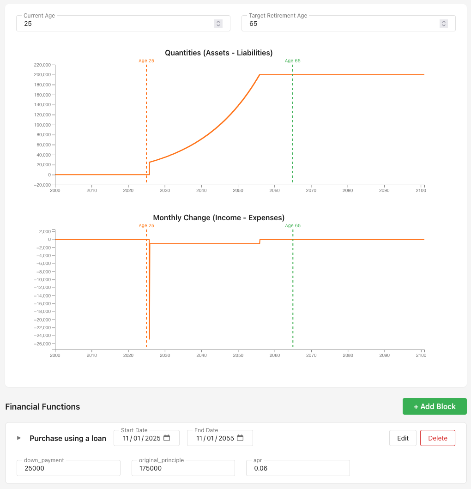

#  PYRE - Plan Your Retirement Easily

A free, open-source financial planning calculator that gives you complete control over your retirement modeling. It was built for financial planning but is really just a timeseries calculator



## What is PYRE?

PYRE takes a fundamentally different approach to financial planning. Instead of rigid categories and assumptions, it provides a flexible math language that lets you model your finances exactly how you want.

Define your current portfolio, add financial events (home purchases, investments, income streams), and watch your future unfold across customizable graphs. Everything from simple savings to complex loan amortization is handled through intuitive "blocks" that you can configure and combine.

## Try It Now - No login Required

**[Launch PYRE →](https://pyre.gpeake.com)**

Start with example configurations or build your plan from scratch. Your data is saved automatically and never leaves your control.

## Development

Built with React, TypeScript, and Cloudflare Workers.

```bash
npm install
npm run dev
```

and you can deploy to your own Cloudflare account with

```bash
npm run deploy
```

## License

MIT License - See LICENSE file for details
